# ManualMaker Frontend
LifeForge - сервис для создания сайтов типом: портфолио, лендинг, визитки. Тогда когда сайт нужен вчера 

# Список технологий
1. Angular - Typescript фреймворк для создания пользовательских интерфейсов
3. TypeScript - язык программирования
4. Scss - css препроцессор

# Статус проекта: В разработке

# Как запускать
## Необходимое ПО
Для запуска проекта необходимо установить 
- [NodeJS](https://nodejs.org/en/download)
- [Git](https://git-scm.com/downloads)

## Клонировать проект
```
git clone https://github.com/CosmosForge/admin.git
cd admin
```

## Установить зависимости
Через pnpm
```
pnpm i
```

или npm
```
npm i
```

или yarn
```
yarn install
```

## Запустить
```
npm run dev
```

# Функционал
Просмотр контента созданный админом


Вкладка для просмотра основных атрибутов сайта и связь с разработчиками
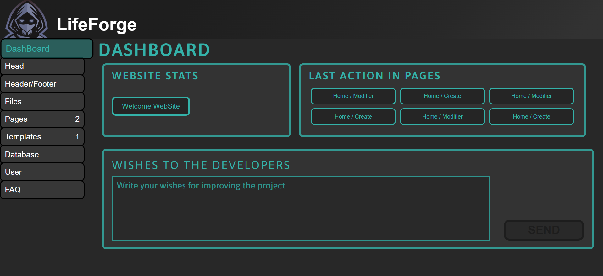

Вкладка в которой можно изменять для всех страниц подключаемые файлы и SEO атрибуты такие как: title, description, tags 
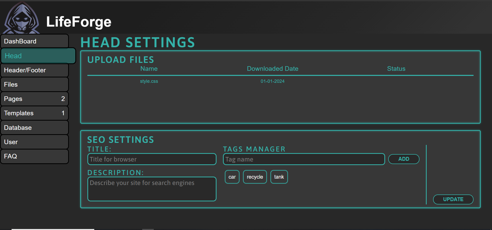

Вкладки в которой при помощи конструктора можно изменять контент шапки и подвала сайта
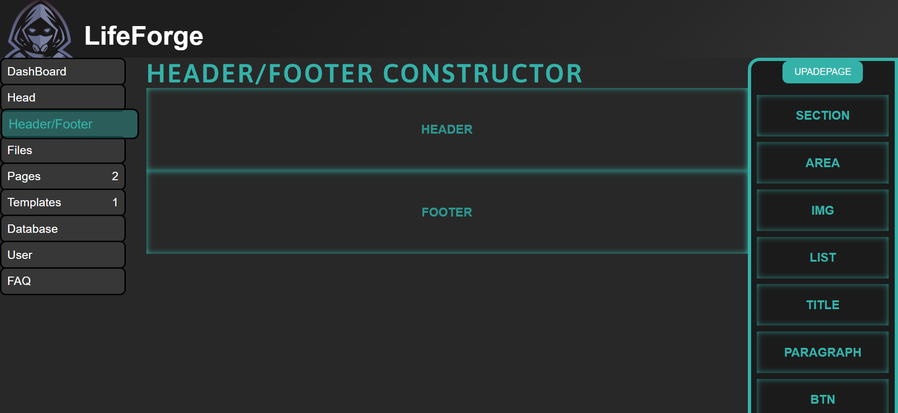

Вкладка в которой можжно загружать и удалть такие файлы как: медиаконтент(картинки, видео...), css, js


Вкладка в которой можно создавать просматривать страницы сайта
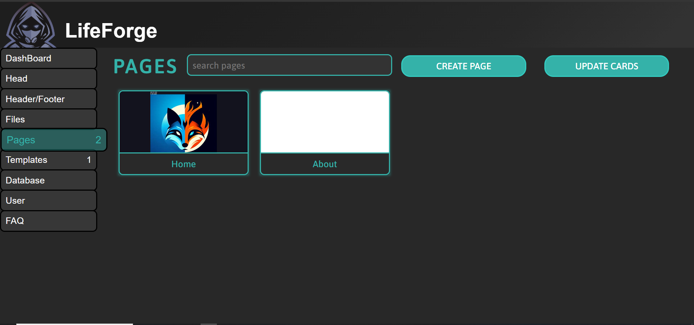

Страница для редактирования SEO и файлы локально для одной страницы
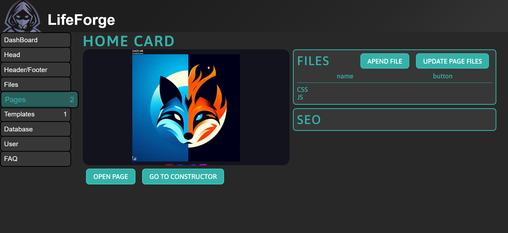

Страница изменения контента используя конструктор CMS
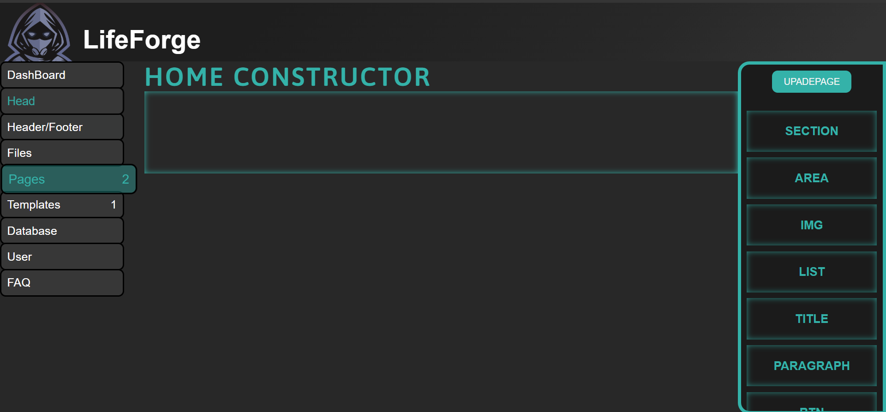

Вкладка для создания шаблонов и просмотр
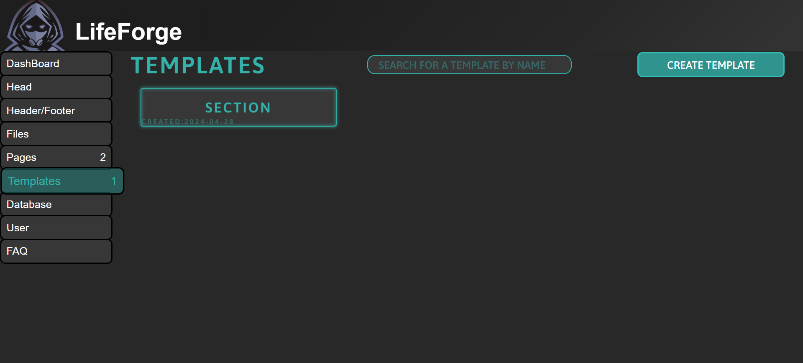

Страница изменения контента шаблона
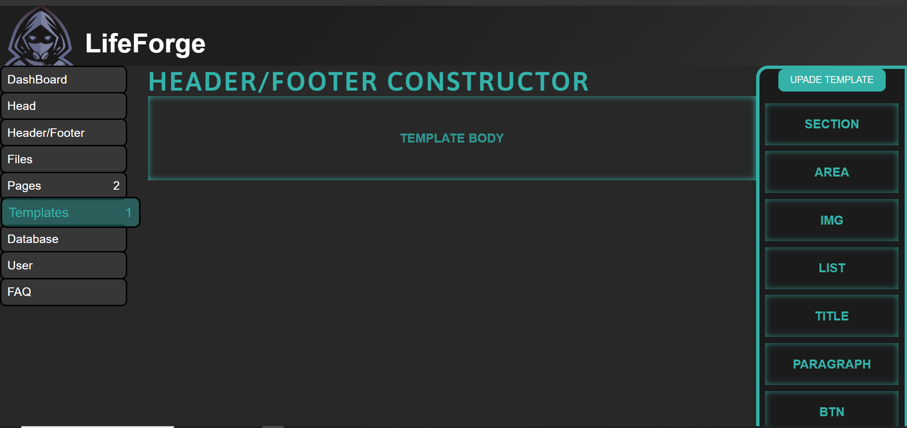

Вкладка для создания, редактирования и CRUD созданных админом таблиц
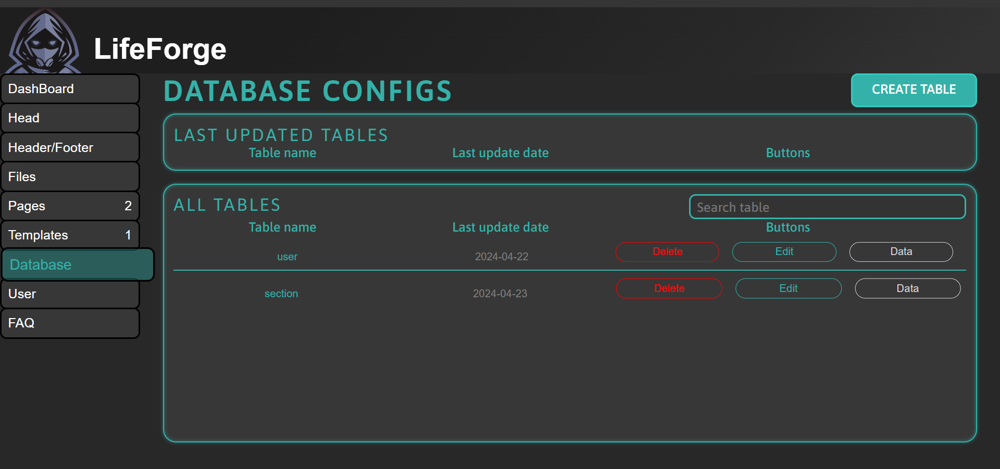

Вкладка для просмотра и редактирования профиля админа
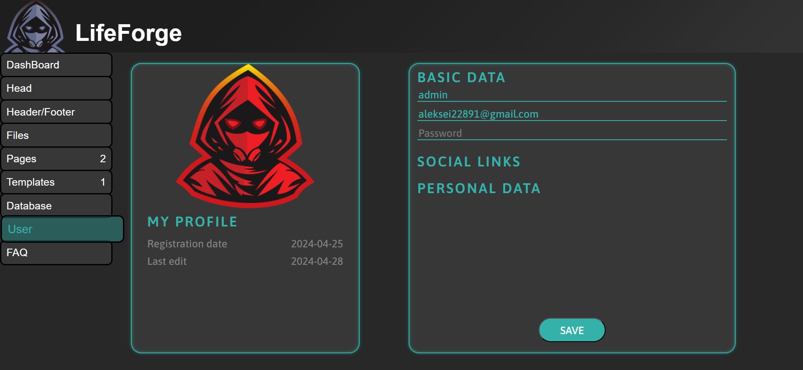

Вкладка для просмотра FAQ
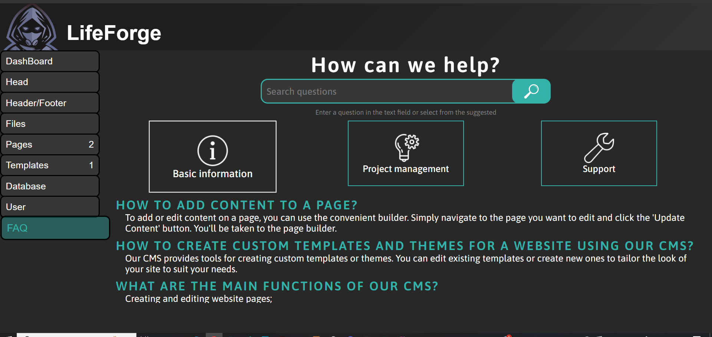

# Благодарности
- [Двитрий Крейвальд Вальеривич](https://github.com/DJDims) - за полезные советы, тестирование проекта
- [Юрий Валентинович Мельников](https://github.com/Dew25) - за полезные советы